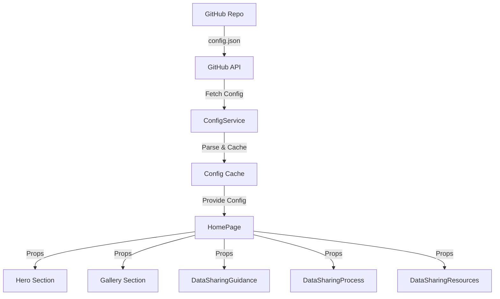
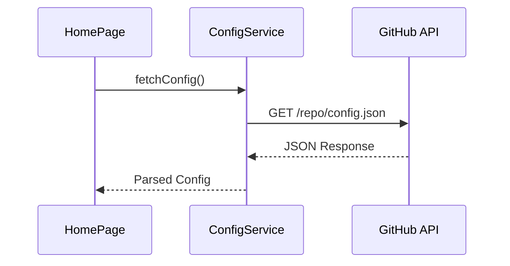
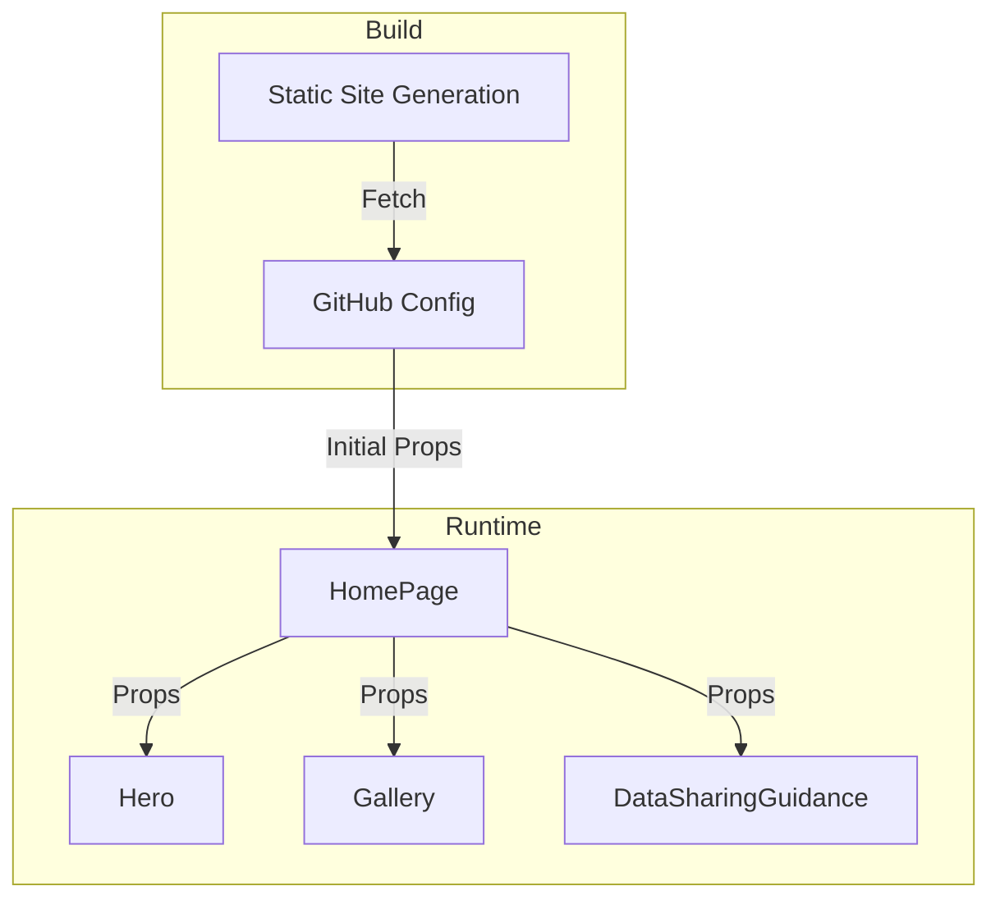

# System Design: Configurable Homepage via GitHub API

## Overview of Solution

The solution implements a GitHub-based configuration system that allows content updates through a JSON configuration file stored in a GitHub repository. The system will use GitHub's API to fetch the configuration data and distribute it to the relevant homepage components. This approach enables content updates without requiring code deployments.



## Component Tree

```
HomePage (existing, modified)
├── ConfigService (new)
├── Hero (existing, modified)
│   ├── HeroHeader (existing, modified)
│   ├── HeroImage (existing, modified)
│   └── HeroMission (existing, modified)
├── Banner (existing)
├── Gallery (existing, modified)
│   └── UpdateCard (existing, modified)
├── DataSharingGuidance (existing, modified)
│   └── GuidanceLink (existing)
├── DataSharingProcess (existing, modified)
└── DataSharingResources (existing)
```

## Component Specifications

### ConfigService (New)
**Purpose**: Manage GitHub API interactions and configuration data retrieval

**Methods**:
- `fetchConfig(): Promise<HomePageConfig>`
  - Arguments: None
  - Returns: Promise resolving to the homepage configuration
  - Description: Fetches and parses configuration from GitHub API



### HomePage (Modified)
**Purpose**: Root component that distributes configuration to child components

**Props**: None

**State**:
```typescript
interface HomePageState {
  config: HomePageConfig | null;
  error: Error | null;
  loading: boolean;
}
```

**Methods**:
- `getStaticProps(): Promise<Props>`
  - Returns: Server-side props containing the configuration
  - Description: Next.js method for static site generation with revalidation

### Hero (Modified)
**Purpose**: Display the main hero section with configurable content

**Props**:
```typescript
interface HeroProps {
  config: {
    title: string;
    subtitle: string;
    mission: {
      title: string;
      description: string;
    };
    image: {
      src: string;
      alt: string;
    };
  };
}
```

### Gallery (Modified)
**Purpose**: Display configurable latest updates section

**Props**:
```typescript
interface GalleryProps {
  config: {
    title: string;
    updates: Array<{
      title: string;
      description: string;
      image: string;
      readMoreColor: string;
      link: string;
    }>;
  };
}
```

### DataSharingGuidance (Modified)
**Purpose**: Display configurable guidance links

**Props**:
```typescript
interface DataSharingGuidanceProps {
  config: {
    title: string;
    leftColumnLinks: Array<{
      text: string;
      href: string;
    }>;
    rightColumnLinks: Array<{
      text: string;
      href: string;
    }>;
  };
}
```

## Configuration Schema

```typescript
interface HomePageConfig {
  hero: {
    title: string;
    subtitle: string;
    mission: {
      title: string;
      description: string;
    };
    image: {
      src: string;
      alt: string;
    };
  };
  gallery: {
    title: string;
    updates: Array<{
      title: string;
      description: string;
      image: string;
      readMoreColor: string;
      link: string;
    }>;
  };
  guidance: {
    title: string;
    leftColumnLinks: Array<{
      text: string;
      href: string;
    }>;
    rightColumnLinks: Array<{
      text: string;
      href: string;
    }>;
  };
  dataSharing: {
    title: string;
    processList: string[];
  };
}
```

## Component Flow



## Implementation Notes

1. Configuration will be fetched at build time using Next.js's static site generation
2. Use incremental static regeneration with a short revalidate time (e.g., 60 seconds) to ensure timely updates
3. Maintain backward compatibility by providing default values for all configurable fields
4. Use TypeScript interfaces to ensure type safety of configuration data
5. Implement error boundaries to handle missing or malformed configuration gracefully
